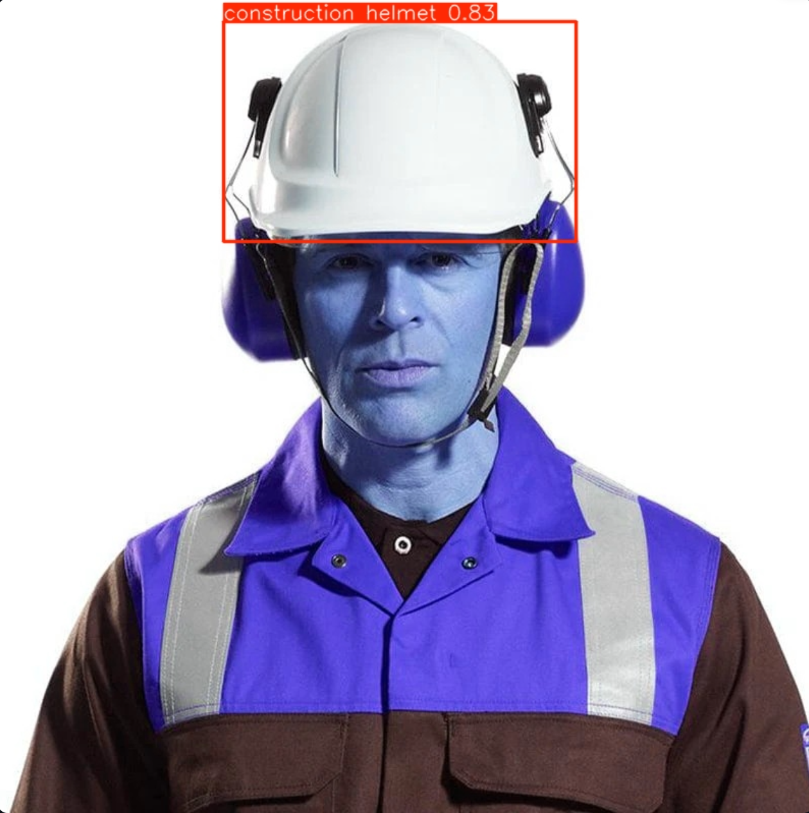
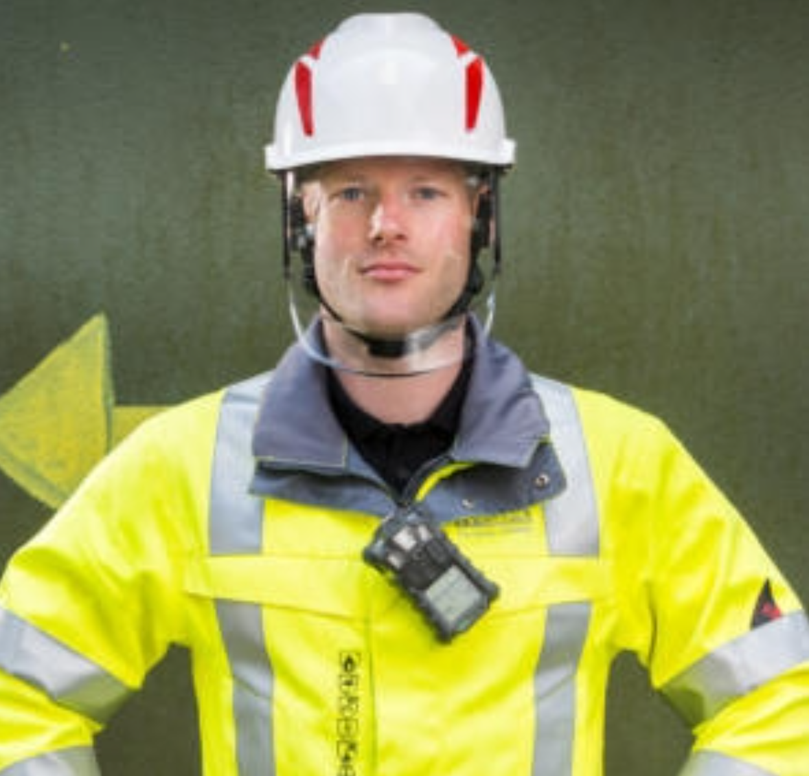
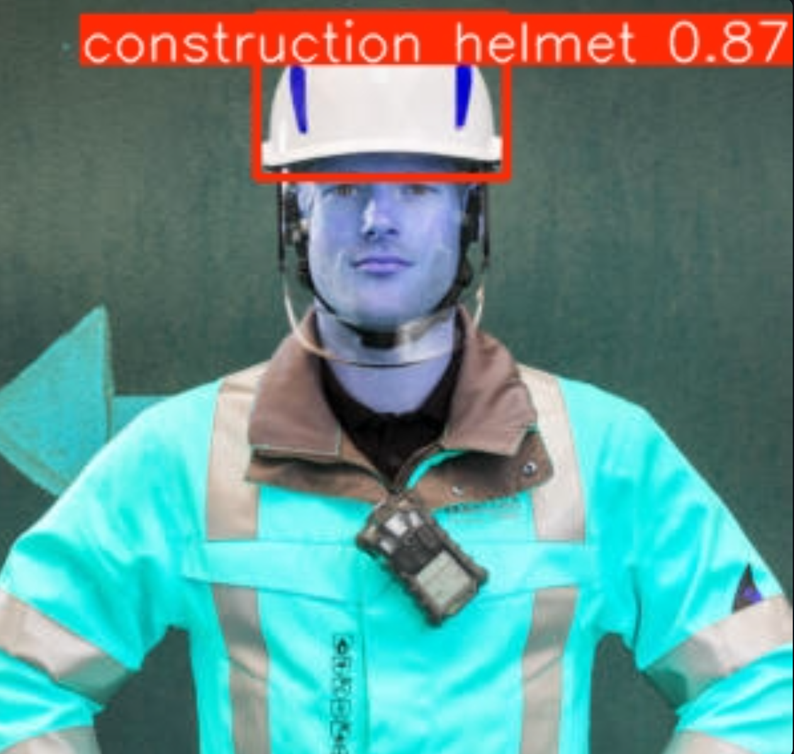

# Helmet Safety Detection with YOLOv11

> Một giải pháp **AI Computer Vision** giúp giám sát **an toàn lao động tại công trường xây dựng**.
> Ứng dụng sử dụng **YOLOv11** để phát hiện công nhân **có đội mũ bảo hộ (Helmet)** hay **không (No Helmet)** trong hình ảnh.

---

## Tính năng chính

* **Upload ảnh** trực tiếp từ máy tính.
* **Nhận diện real-time** với YOLOv11.
* Hiển thị bounding box.
* Xuất bảng chi tiết (class, confidence, toạ độ).
* Deploy dễ dàng trên **Streamlit Cloud**.

---

## Demo

[Truy cập ứng dụng Streamlit tại đây](https://yolo-helmet-detector.streamlit.app/)

Ảnh gốc vs kết quả nhận diện:

| Ảnh gốc | Kết quả |
|---------|---------|
|  |  |
|  |  |


## Cấu trúc dự án

```bash
yolo-helmet-detector/
│
├── app.py                     # File chính chạy Streamlit
├── requirements.txt           # Danh sách thư viện
├── README.md                  # Tài liệu dự án
│
├── demo/                      # Ảnh demo minh họa
│   ├── worker1.png
│   ├── worker1_result.png
│   ├── worker2.png
│   └── worker2_result.png
│
├── models/                    # Model YOLOv11 đã train
│   └── helmet_detection_best.pt
│
└── training/                  # Script/training pipeline
```

---

## Cài đặt Local

### 1. Clone repo

```bash
git clone https://github.com/danh-nguyen2210/yolo-helmet-detector.git
cd yolo-helmet-detector
```

### 2. Cài dependencies

```bash
pip install -r requirements.txt
```

### 3. Chạy ứng dụng

```bash
streamlit run app.py
```

## Ứng dụng thực tế

* Giám sát công trường xây dựng.
* Hệ thống cảnh báo tự động nếu phát hiện công nhân **không đội mũ bảo hộ**.
* Tích hợp với **camera an ninh** để chạy **real-time**.

---

## Công nghệ

* [Streamlit](https://streamlit.io/) – giao diện web dễ triển khai
* [YOLOv11 - Ultralytics](https://github.com/ultralytics/ultralytics) – state-of-the-art object detection
* [PyTorch](https://pytorch.org/) – deep learning framework
* [OpenCV](https://opencv.org/) – xử lý ảnh/video
